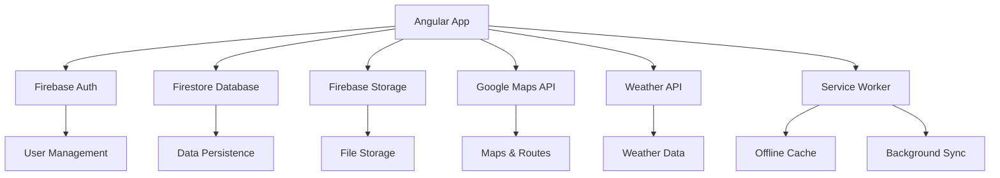

# Design Document - Andes Trip Manager

## Overview

O Moto Trip Manager é uma aplicação web Angular moderna que utiliza Firebase como backend completo. A arquitetura segue os padrões de desenvolvimento Angular com componentes standalone, implementando uma estrutura modular e escalável para gerenciamento de viagens de motocicleta.

### Tecnologias Principais

- **Frontend**: Angular 17+ com componentes standalone
- **UI Framework**: Angular Material
- **Backend**: Firebase (Firestore, Authentication, Storage)
- **Mapas**: Google Maps API ou Leaflet
- **PWA**: Service Workers para funcionalidade offline
- **Localização**: Configuração pt-BR completa

## Architecture

### Arquitetura Geral



### Estrutura de Pastas

```
src/
├── app/
│   ├── core/                    # Serviços singleton e funcionalidades centrais
│   │   ├── guards/             # AuthGuard, RoleGuard
│   │   ├── interceptors/       # HTTP interceptors
│   │   ├── services/           # Firebase, Cache, Sync
│   │   └── models/             # Interfaces base
│   ├── shared/                 # Componentes e utilitários reutilizáveis
│   │   ├── components/         # UI components compartilhados
│   │   ├── pipes/             # Pipes customizados
│   │   ├── directives/        # Diretivas customizadas
│   │   └── services/          # Serviços compartilhados
│   ├── features/              # Módulos de funcionalidades
│   │   ├── auth/              # Autenticação e perfil
│   │   ├── dashboard/         # Dashboard principal
│   │   ├── viagens/           # Gerenciamento de viagens
│   │   ├── dias-viagem/       # Planejamento de dias
│   │   ├── paradas/           # Gerenciamento de paradas
│   │   ├── hospedagens/       # Controle de hospedagens
│   │   ├── custos/            # Controle financeiro
│   │   ├── clima/             # Informações climáticas
│   │   ├── manutencao/        # Controle de manutenções
│   │   ├── diario/            # Diário de bordo
│   │   └── exportacao/        # Exportação e backup
│   ├── models/                # Interfaces e tipos TypeScript
│   ├── services/              # Serviços de negócio
│   ├── utils/                 # Funções utilitárias
│   ├── app.config.ts          # Configuração da aplicação
│   ├── app.routes.ts          # Roteamento principal
│   └── app.component.ts       # Componente raiz
├── environments/              # Configurações de ambiente
├── assets/                    # Recursos estáticos
└── styles/                    # Estilos globais
```

## Components and Interfaces

### Componentes Principais (Standalone)

#### 1. Componentes de Autenticação

```typescript
// LoginComponent - Tela de login
@Component({
  selector: "app-login",
  standalone: true,
  imports: [
    CommonModule,
    ReactiveFormsModule,
    MatCardModule,
    MatButtonModule,
    MatInputModule,
  ],
  templateUrl: "./login.component.html",
})
export class LoginComponent {
  loginForm: FormGroup;
  // Implementação do login com Firebase Auth
}

// RegisterComponent - Registro de usuário
@Component({
  selector: "app-register",
  standalone: true,
  imports: [
    CommonModule,
    ReactiveFormsModule,
    MatCardModule,
    MatButtonModule,
    MatInputModule,
  ],
  templateUrl: "./register.component.html",
})
export class RegisterComponent {
  registerForm: FormGroup;
  // Implementação do registro
}

// ProfileComponent - Perfil do usuário
@Component({
  selector: "app-profile",
  standalone: true,
  imports: [
    CommonModule,
    ReactiveFormsModule,
    MatCardModule,
    MatButtonModule,
    MatInputModule,
  ],
  templateUrl: "./profile.component.html",
})
export class ProfileComponent {
  profileForm: FormGroup;
  // Edição de perfil com upload de foto
}
```

#### 2. Componentes de Viagem

```typescript
// DashboardComponent - Dashboard principal
@Component({
  selector: "app-dashboard",
  standalone: true,
  imports: [
    CommonModule,
    MatCardModule,
    MatButtonModule,
    MatIconModule,
    ViagemCardComponent,
  ],
  templateUrl: "./dashboard.component.html",
})
export class DashboardComponent {
  viagens$: Observable<Viagem[]>;
  filtroStatus: StatusViagem | null = null;
  // Lista e filtros de viagens
}

// ViagemCardComponent - Card de viagem
@Component({
  selector: "app-viagem-card",
  standalone: true,
  imports: [
    CommonModule,
    MatCardModule,
    MatButtonModule,
    MatIconModule,
    MatChipsModule,
  ],
  templateUrl: "./viagem-card.component.html",
})
export class ViagemCardComponent {
  @Input() viagem!: Viagem;
  @Output() editarViagem = new EventEmitter<string>();
  @Output() excluirViagem = new EventEmitter<string>();
}

// ViagemFormComponent - Formulário de viagem
@Component({
  selector: "app-viagem-form",
  standalone: true,
  imports: [
    CommonModule,
    ReactiveFormsModule,
    MatCardModule,
    MatButtonModule,
    MatInputModule,
    MatDatepickerModule,
  ],
  templateUrl: "./viagem-form.component.html",
})
export class ViagemFormComponent {
  viagemForm: FormGroup;
  isEditMode: boolean = false;
  // Criação e edição de viagens
}

// ViagemDetailComponent - Detalhes da viagem com abas
@Component({
  selector: "app-viagem-detail",
  standalone: true,
  imports: [
    CommonModule,
    MatTabsModule,
    MatCardModule,
    DiasViagemComponent,
    ParadasComponent,
    HospedagensComponent,
  ],
  templateUrl: "./viagem-detail.component.html",
})
export class ViagemDetailComponent {
  viagem$: Observable<Viagem>;
  selectedTabIndex: number = 0;
  // Navegação entre abas da viagem
}
```

#### 3. Componentes de Dias e Paradas

```typescript
// DiasViagemComponent - Timeline de dias
@Component({
  selector: "app-dias-viagem",
  standalone: true,
  imports: [
    CommonModule,
    MatCardModule,
    MatButtonModule,
    MatIconModule,
    CdkDragDrop,
  ],
  templateUrl: "./dias-viagem.component.html",
})
export class DiasViagemComponent {
  @Input() viagemId!: string;
  dias$: Observable<DiaViagem[]>;
  // Timeline com drag & drop para reordenação
}

// DiaViagemDetailComponent - Detalhes do dia
@Component({
  selector: "app-dia-viagem-detail",
  standalone: true,
  imports: [CommonModule, MatCardModule, GoogleMapsModule, ParadaCardComponent],
  templateUrl: "./dia-viagem-detail.component.html",
})
export class DiaViagemDetailComponent {
  @Input() diaId!: string;
  dia$: Observable<DiaViagem>;
  paradas$: Observable<Parada[]>;
  // Mapa e paradas do dia
}

// ParadaFormComponent - Formulário de parada
@Component({
  selector: "app-parada-form",
  standalone: true,
  imports: [
    CommonModule,
    ReactiveFormsModule,
    MatCardModule,
    MatSelectModule,
    MatInputModule,
  ],
  templateUrl: "./parada-form.component.html",
})
export class ParadaFormComponent {
  paradaForm: FormGroup;
  tiposParada = TipoParada;
  // Formulário dinâmico baseado no tipo de parada
}
```

### Interfaces de Dados

```typescript
// Interfaces base
interface BaseEntity {
  id?: string;
  criadoEm?: Timestamp;
  atualizadoEm?: Timestamp;
  usuarioId: string;
}

// Enums
enum StatusViagem {
  PLANEJADA = "planejada",
  EM_ANDAMENTO = "em-andamento",
  FINALIZADA = "finalizada",
}

enum TipoParada {
  ABASTECIMENTO = "abastecimento",
  REFEICAO = "refeicao",
  PONTO_INTERESSE = "ponto-interesse",
}

enum TipoCusto {
  COMBUSTIVEL = "combustivel",
  HOSPEDAGEM = "hospedagem",
  ALIMENTACAO = "alimentacao",
  MANUTENCAO = "manutencao",
  OUTROS = "outros",
}

// Entidades principais
interface Usuario extends BaseEntity {
  nome: string;
  email: string;
  fotoUrl?: string;
  telefone?: string;
  motocicleta?: {
    marca: string;
    modelo: string;
    ano: number;
    placa: string;
  };
}

interface Viagem extends BaseEntity {
  nome: string;
  descricao: string;
  dataInicio: string;
  dataFim: string;
  status: StatusViagem;
  distanciaTotal?: number;
  tempoEstimado?: number;
  orcamento?: number;
  custoTotal?: number;
}

interface DiaViagem extends BaseEntity {
  viagemId: string;
  ordem: number;
  data: string;
  cidadeOrigem: string;
  cidadeDestino: string;
  distancia?: number;
  tempoEstimado?: number;
  observacoes?: string;
  coordenadas?: {
    origem: { lat: number; lng: number };
    destino: { lat: number; lng: number };
  };
}

interface Parada extends BaseEntity {
  diaViagemId: string;
  tipo: TipoParada;
  nome: string;
  endereco: string;
  coordenadas: { lat: number; lng: number };
  horario?: string;
  observacoes?: string;
  fotos?: string[];

  // Campos específicos por tipo
  abastecimento?: {
    combustivel: string;
    litros: number;
    precoLitro: number;
    total: number;
  };

  refeicao?: {
    tipoRefeicao: string;
    preco?: number;
    avaliacao?: number;
  };

  pontoInteresse?: {
    categoria: string;
    descricao: string;
    tempoVisita?: number;
  };
}

interface Hospedagem extends BaseEntity {
  diaViagemId: string;
  nome: string;
  endereco: string;
  coordenadas: { lat: number; lng: number };
  dataCheckin: string;
  dataCheckout: string;
  preco: number;
  estacionamentoCoberto: boolean;
  linkReserva?: string;
  observacoes?: string;
  fotos?: string[];
  avaliacao?: number;
}

interface Custo extends BaseEntity {
  viagemId: string;
  diaViagemId?: string;
  tipo: TipoCusto;
  descricao: string;
  valor: number;
  data: string;
  observacoes?: string;
  comprovante?: string;
}

interface Clima extends BaseEntity {
  diaViagemId: string;
  data: string;
  previsao?: {
    temperaturaMin: number;
    temperaturaMax: number;
    condicao: string;
    chanceChuva: number;
    vento: number;
    umidade: number;
  };
  observado?: {
    temperatura: number;
    condicao: string;
    choveu: boolean;
    observacoes: string;
  };
}

interface Manutencao extends BaseEntity {
  viagemId?: string;
  tipo: "pre-viagem" | "durante-viagem";
  data: string;
  descricao: string;
  itensVerificados: {
    item: string;
    status: "ok" | "atencao" | "problema";
    observacoes?: string;
  }[];
  custo?: number;
  local?: string;
}

interface DiarioBordo extends BaseEntity {
  viagemId: string;
  diaViagemId?: string;
  data: string;
  titulo?: string;
  conteudo: string;
  fotos?: string[];
  publico: boolean;
}
```

## Data Models

### Estrutura do Firestore

```
users/
├── {userId}/
│   ├── nome: string
│   ├── email: string
│   ├── fotoUrl: string
│   ├── telefone: string
│   ├── motocicleta: object
│   ├── criadoEm: timestamp
│   └── atualizadoEm: timestamp

viagens/
├── {viagemId}/
│   ├── usuarioId: string
│   ├── nome: string
│   ├── descricao: string
│   ├── dataInicio: string
│   ├── dataFim: string
│   ├── status: string
│   ├── distanciaTotal: number
│   ├── tempoEstimado: number
│   ├── orcamento: number
│   ├── custoTotal: number
│   ├── criadoEm: timestamp
│   └── atualizadoEm: timestamp

dias-viagem/
├── {diaId}/
│   ├── viagemId: string
│   ├── usuarioId: string
│   ├── ordem: number
│   ├── data: string
│   ├── cidadeOrigem: string
│   ├── cidadeDestino: string
│   ├── distancia: number
│   ├── tempoEstimado: number
│   ├── observacoes: string
│   ├── coordenadas: object
│   ├── criadoEm: timestamp
│   └── atualizadoEm: timestamp

paradas/
├── {paradaId}/
│   ├── diaViagemId: string
│   ├── usuarioId: string
│   ├── tipo: string
│   ├── nome: string
│   ├── endereco: string
│   ├── coordenadas: object
│   ├── horario: string
│   ├── observacoes: string
│   ├── fotos: array
│   ├── abastecimento: object (opcional)
│   ├── refeicao: object (opcional)
│   ├── pontoInteresse: object (opcional)
│   ├── criadoEm: timestamp
│   └── atualizadoEm: timestamp

hospedagens/
├── {hospedagemId}/
│   ├── diaViagemId: string
│   ├── usuarioId: string
│   ├── nome: string
│   ├── endereco: string
│   ├── coordenadas: object
│   ├── dataCheckin: string
│   ├── dataCheckout: string
│   ├── preco: number
│   ├── estacionamentoCoberto: boolean
│   ├── linkReserva: string
│   ├── observacoes: string
│   ├── fotos: array
│   ├── avaliacao: number
│   ├── criadoEm: timestamp
│   └── atualizadoEm: timestamp

custos/
├── {custoId}/
│   ├── viagemId: string
│   ├── diaViagemId: string (opcional)
│   ├── usuarioId: string
│   ├── tipo: string
│   ├── descricao: string
│   ├── valor: number
│   ├── data: string
│   ├── observacoes: string
│   ├── comprovante: string
│   ├── criadoEm: timestamp
│   └── atualizadoEm: timestamp

clima/
├── {climaId}/
│   ├── diaViagemId: string
│   ├── usuarioId: string
│   ├── data: string
│   ├── previsao: object
│   ├── observado: object
│   ├── criadoEm: timestamp
│   └── atualizadoEm: timestamp

manutencoes/
├── {manutencaoId}/
│   ├── viagemId: string (opcional)
│   ├── usuarioId: string
│   ├── tipo: string
│   ├── data: string
│   ├── descricao: string
│   ├── itensVerificados: array
│   ├── custo: number
│   ├── local: string
│   ├── criadoEm: timestamp
│   └── atualizadoEm: timestamp

diario-bordo/
├── {diarioId}/
│   ├── viagemId: string
│   ├── diaViagemId: string (opcional)
│   ├── usuarioId: string
│   ├── data: string
│   ├── titulo: string
│   ├── conteudo: string
│   ├── fotos: array
│   ├── publico: boolean
│   ├── criadoEm: timestamp
│   └── atualizadoEm: timestamp
```

### Regras de Segurança do Firestore

```javascript
rules_version = '2';
service cloud.firestore {
  match /databases/{database}/documents {
    // Regra base: usuário só acessa seus próprios dados
    function isOwner(userId) {
      return request.auth != null && request.auth.uid == userId;
    }

    // Usuários
    match /users/{userId} {
      allow read, write: if isOwner(userId);
    }

    // Viagens
    match /viagens/{viagemId} {
      allow read, write: if isOwner(resource.data.usuarioId);
    }

    // Dias de viagem
    match /dias-viagem/{diaId} {
      allow read, write: if isOwner(resource.data.usuarioId);
    }

    // Paradas
    match /paradas/{paradaId} {
      allow read, write: if isOwner(resource.data.usuarioId);
    }

    // Hospedagens
    match /hospedagens/{hospedagemId} {
      allow read, write: if isOwner(resource.data.usuarioId);
    }

    // Custos
    match /custos/{custoId} {
      allow read, write: if isOwner(resource.data.usuarioId);
    }

    // Clima
    match /clima/{climaId} {
      allow read, write: if isOwner(resource.data.usuarioId);
    }

    // Manutenções
    match /manutencoes/{manutencaoId} {
      allow read, write: if isOwner(resource.data.usuarioId);
    }

    // Diário de bordo
    match /diario-bordo/{diarioId} {
      allow read: if resource.data.publico == true || isOwner(resource.data.usuarioId);
      allow write: if isOwner(resource.data.usuarioId);
    }
  }
}
```

## Error Handling

### Estratégia de Tratamento de Erros

```typescript
// ErrorHandlerService - Serviço centralizado de erros
@Injectable({ providedIn: "root" })
export class ErrorHandlerService {
  constructor(private snackBar: MatSnackBar) {}

  handleError(error: any, context?: string): void {
    console.error(`[ERRO${context ? ` - ${context}` : ""}]:`, error);

    let mensagem = "Ocorreu um erro inesperado.";

    if (error.code) {
      mensagem = this.getFirebaseErrorMessage(error.code);
    } else if (error.message) {
      mensagem = error.message;
    }

    this.snackBar.open(mensagem, "Fechar", {
      duration: 5000,
      panelClass: ["error-snackbar"],
    });
  }

  private getFirebaseErrorMessage(code: string): string {
    const mensagens: { [key: string]: string } = {
      "auth/user-not-found": "Usuário não encontrado.",
      "auth/wrong-password": "Senha incorreta.",
      "auth/email-already-in-use": "Este email já está em uso.",
      "auth/weak-password": "A senha deve ter pelo menos 6 caracteres.",
      "auth/invalid-email": "Email inválido.",
      "auth/network-request-failed": "Erro de conexão. Verifique sua internet.",
      "permission-denied": "Você não tem permissão para esta ação.",
      unavailable: "Serviço temporariamente indisponível.",
      "not-found": "Documento não encontrado.",
      "already-exists": "Documento já existe.",
    };

    return mensagens[code] || "Erro desconhecido.";
  }
}

// HTTP Error Interceptor
@Injectable()
export class ErrorInterceptor implements HttpInterceptor {
  constructor(private errorHandler: ErrorHandlerService) {}

  intercept(
    req: HttpRequest<any>,
    next: HttpHandler
  ): Observable<HttpEvent<any>> {
    return next.handle(req).pipe(
      catchError((error: HttpErrorResponse) => {
        this.errorHandler.handleError(error, "HTTP");
        return throwError(() => error);
      })
    );
  }
}
```

### Validação de Formulários

```typescript
// Validadores customizados
export class CustomValidators {
  static cpf(control: AbstractControl): ValidationErrors | null {
    const cpf = control.value?.replace(/\D/g, "");
    if (!cpf || cpf.length !== 11) {
      return { cpfInvalido: true };
    }
    // Lógica de validação do CPF
    return null;
  }

  static cep(control: AbstractControl): ValidationErrors | null {
    const cep = control.value?.replace(/\D/g, "");
    if (!cep || cep.length !== 8) {
      return { cepInvalido: true };
    }
    return null;
  }

  static dataFutura(control: AbstractControl): ValidationErrors | null {
    const data = new Date(control.value);
    const hoje = new Date();
    if (data <= hoje) {
      return { dataPassada: true };
    }
    return null;
  }
}

// Mensagens de erro padronizadas
export const MENSAGENS_VALIDACAO = {
  required: "Este campo é obrigatório",
  email: "Email deve ter um formato válido",
  minlength: "Mínimo de {requiredLength} caracteres",
  maxlength: "Máximo de {requiredLength} caracteres",
  min: "Valor mínimo: {min}",
  max: "Valor máximo: {max}",
  cpfInvalido: "CPF inválido",
  cepInvalido: "CEP inválido",
  dataPassada: "Data deve ser futura",
};
```

## Testing Strategy

### Estrutura de Testes

```typescript
// Testes unitários para componentes
describe("ViagemCardComponent", () => {
  let component: ViagemCardComponent;
  let fixture: ComponentFixture<ViagemCardComponent>;

  beforeEach(async () => {
    await TestBed.configureTestingModule({
      imports: [ViagemCardComponent, MatCardModule, MatButtonModule],
    }).compileComponents();

    fixture = TestBed.createComponent(ViagemCardComponent);
    component = fixture.componentInstance;
    component.viagem = mockViagem;
    fixture.detectChanges();
  });

  it("deve criar o componente", () => {
    expect(component).toBeTruthy();
  });

  it("deve emitir evento ao clicar em editar", () => {
    spyOn(component.editarViagem, "emit");
    const botaoEditar = fixture.debugElement.query(
      By.css('[data-test="btn-editar"]')
    );

    botaoEditar.nativeElement.click();

    expect(component.editarViagem.emit).toHaveBeenCalledWith(mockViagem.id);
  });
});

// Testes de integração para serviços
describe("ViagensService", () => {
  let service: ViagensService;
  let firestore: AngularFirestore;

  beforeEach(() => {
    TestBed.configureTestingModule({
      imports: [AngularFirestoreModule],
      providers: [{ provide: AngularFirestore, useValue: mockFirestore }],
    });
    service = TestBed.inject(ViagensService);
    firestore = TestBed.inject(AngularFirestore);
  });

  it("deve criar nova viagem", async () => {
    const novaViagem: Viagem = mockViagem;
    spyOn(firestore.collection("viagens"), "add").and.returnValue(
      Promise.resolve()
    );

    await service.novo(novaViagem);

    expect(firestore.collection).toHaveBeenCalledWith("viagens");
  });
});

// Testes E2E com Cypress
describe("Fluxo de Criação de Viagem", () => {
  beforeEach(() => {
    cy.login("usuario@teste.com", "senha123");
    cy.visit("/dashboard");
  });

  it("deve criar nova viagem completa", () => {
    cy.get('[data-test="btn-nova-viagem"]').click();
    cy.get('[data-test="input-nome"]').type("Viagem de Teste");
    cy.get('[data-test="input-descricao"]').type("Descrição da viagem");
    cy.get('[data-test="input-data-inicio"]').type("2024-06-01");
    cy.get('[data-test="input-data-fim"]').type("2024-06-05");
    cy.get('[data-test="btn-salvar"]').click();

    cy.url().should("include", "/viagens/");
    cy.get('[data-test="viagem-nome"]').should("contain", "Viagem de Teste");
  });
});
```

### Mocks e Fixtures

```typescript
// Mock data para testes
export const mockUsuario: Usuario = {
  id: "user-123",
  nome: "João Silva",
  email: "joao@teste.com",
  usuarioId: "user-123",
  criadoEm: Timestamp.now(),
  atualizadoEm: Timestamp.now(),
};

export const mockViagem: Viagem = {
  id: "viagem-123",
  usuarioId: "user-123",
  nome: "Viagem de Teste",
  descricao: "Descrição da viagem",
  dataInicio: "2024-06-01",
  dataFim: "2024-06-05",
  status: StatusViagem.PLANEJADA,
  criadoEm: Timestamp.now(),
  atualizadoEm: Timestamp.now(),
};

// Mock do Firestore
export const mockFirestore = {
  collection: jasmine.createSpy("collection").and.returnValue({
    add: jasmine.createSpy("add"),
    doc: jasmine.createSpy("doc").and.returnValue({
      update: jasmine.createSpy("update"),
      delete: jasmine.createSpy("delete"),
      get: jasmine.createSpy("get"),
    }),
    where: jasmine.createSpy("where").and.returnThis(),
    orderBy: jasmine.createSpy("orderBy").and.returnThis(),
    valueChanges: jasmine.createSpy("valueChanges").and.returnValue(of([])),
  }),
};
```

### Configuração de Testes

```typescript
// karma.conf.js
module.exports = function (config) {
  config.set({
    basePath: "",
    frameworks: ["jasmine", "@angular-devkit/build-angular"],
    plugins: [
      require("karma-jasmine"),
      require("karma-chrome-headless"),
      require("karma-coverage"),
      require("@angular-devkit/build-angular/plugins/karma"),
    ],
    coverageReporter: {
      dir: require("path").join(__dirname, "./coverage/andes-trip-manager"),
      subdir: ".",
      reporters: [
        { type: "html" },
        { type: "text-summary" },
        { type: "lcovonly" },
      ],
    },
    browsers: ["ChromeHeadless"],
    singleRun: true,
    restartOnFileChange: true,
  });
};

// cypress.config.ts
import { defineConfig } from "cypress";

export default defineConfig({
  e2e: {
    baseUrl: "http://localhost:4200",
    supportFile: "cypress/support/e2e.ts",
    specPattern: "cypress/e2e/**/*.cy.ts",
    video: false,
    screenshot: false,
  },
});
```

## Considerações de Performance

### Otimizações Implementadas

1. **Lazy Loading**: Todos os módulos de funcionalidades são carregados sob demanda
2. **OnPush Change Detection**: Componentes utilizam ChangeDetectionStrategy.OnPush
3. **Virtual Scrolling**: Para listas grandes de viagens e paradas
4. **Image Optimization**: Compressão automática de imagens antes do upload
5. **Caching**: Cache inteligente de dados com TTL configurável
6. **Bundle Splitting**: Separação de código por funcionalidade

### PWA e Funcionalidade Offline

```typescript
// Service Worker configuration
@Injectable({ providedIn: "root" })
export class OfflineService {
  private isOnline = new BehaviorSubject<boolean>(navigator.onLine);
  private pendingOperations: any[] = [];

  constructor(private swUpdate: SwUpdate) {
    // Detectar mudanças de conectividade
    window.addEventListener("online", () => this.updateOnlineStatus(true));
    window.addEventListener("offline", () => this.updateOnlineStatus(false));

    // Sincronização quando voltar online
    this.isOnline
      .pipe(
        filter((online) => online),
        switchMap(() => this.syncPendingOperations())
      )
      .subscribe();
  }

  private updateOnlineStatus(isOnline: boolean): void {
    this.isOnline.next(isOnline);
  }

  private syncPendingOperations(): Observable<any> {
    // Implementar sincronização de operações pendentes
    return from(this.pendingOperations).pipe(
      concatMap((operation) => this.executeOperation(operation)),
      tap(() => (this.pendingOperations = []))
    );
  }
}
```

Este design fornece uma base sólida para implementação do Andes Trip Manager, seguindo as melhores práticas do Angular e garantindo escalabilidade, manutenibilidade e uma excelente experiência do usuário.
